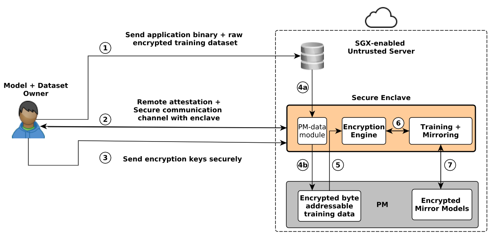
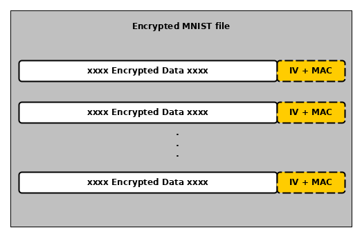

## Summary
- `Plinius` is a secure machine learning framework which leverages `Intel SGX` for secure training of neural network models, and `persistent memory` (PM) for fault tolerance.
- Plinius consists of two main libraries: [sgx-romulus](https://github.com/anonymous-xh/sgx-romulus) which is an Intel SGX-compatible PM library we ported from Romulus PM library, and [sgx-dnet](https://github.com/anonymous-xh/sgx-dnet) which is a port of [Darknet](http://pjreddie.com/darknet) ML framework into Intel SGX.
- This readme gives a quick rundown on how to test secure training in Plinius as described in our paper.
- NB: Commands here are for linux-based systems 
- Prerequisites: to build and run this project you must have atleast (simulation mode only) the [Intel SGX SDK](https://github.com/intel/linux-sgx) installed. 


## Training and testing a model in Plinius
### Intro
- As described in the paper, training a model in Plinius is summarized in the workflow below:

- For the sake of simplicity we assume RA and SC have been done successfully and the encryption key has been provisioned to the enclave.i.e `enc_key` variable in [trainer.cpp](Enclave/dnet-in/train/trainer.cpp). This is the same key used for encrypting the mnist data set.
- We created an encrypted version of the MNIST data set, located in the `App/dnet-out/data/mnist` folder.
- The encrypted images are divided into four chunks: `img.a-e`. 
- Combine the images into one file with the command: `cat img.?? > enc_mnist_imgs.data`
- `enc_mnist_imgs.data` contains 60k encrypted mnist images and `enc_mnist_labels.data` contains 60k corresponding encrypted labels.
- The images and labels are encrypted with AES-GCM encryption algorithm, with a 16 byte MAC and 12 byte IV attached to each encrypted element (e.g. image or label).
- `t10k-images*` and `t10k-labels*` represent the images and labels in the default MNIST test dataset.
- For clearer comprehension, the encrypted image and label files have the form below:


## Setting up persistent memory
- If you have a machine with real persistent memory, use the following commands to format and mount the drive with DAX enabled. We assume the PM device is `/dev/pmem0`.
```
$ sudo mkdir /mnt/pmem0
$ sudo mkfs.ext4 /dev/pmem0
$ sudo mount -t ext4 -o dax /dev/pmem0 /mnt/pmem0

```
- If you do not have real PM, you can emulate it with DRAM (ramdisk), using a temporary filesystem (i.e `tmpfs`) using the following instructions.
```
$ sudo mkdir /mnt/pmem0
$ sudo mount -t tmpfs /dev/pmem0 /mnt/pmem0

```
- All plinius data will then be stored in `/mnt/pmem0/plinius_data`. Modify this path if needed in the file: [Romulus_helper.h](App/Romulus_helper.h). 
- By default, Plinius uses a `CLFLUSH` instruction for persistent write backs. You can modify this to use an optimized cache-line flush instruction like `CLFLUSHOPT` supported by your CPU. To do this, redefine the `PWB` macro in [pfences.h](Enclave/romulus/common/pfences.h) accordingly. For example: `#define PWB_IS_CLFLUSHOPT`.

### Training the model
- Plinius is mainly designed for model training but we can do inference too. We added the default mnist test set (10k unencrypted labeled images) just for the purpose of testing the accuracy of our trained model. 
- In a real setting a programmer who wishes to do inference with Plinius will have to encrypt his inference set and load to PM following the same idea/workflow.
- We used mnist data set as a proof of concept, the same idea can be applied with a different data set once the workflow is understood.
- As described in the paper, we first initialize sgx-rom in the main routine via `rom_init` and `ecall_init` and invoke the `train_mnist` function.
- `train_mnist` reads the corresponding network/model configuration file and parses it into a config data structure and sends this to the enclave runtime via the `ecall_trainer` ecall. The config file used in this [example](App/dnet-out/cfg/mnist.cfg) describes a neural network model with 12 LRELU convolutional layers + other intermediary pooling layers, batch size of 128, learning rate of 0.1 and other important hyperparameters. Feel free to modify the config as it suits you, but make sure to follow the correct syntax (i.e Darknet config file syntax).
- In the enclave we load the encrypted data once into PM and begin the training iterations. 
- For each iteration, the routine reads batches of encrypted data from PM, decrypts the former in the enclave, trains the model with the batch, and the mirrors-out weights to PM.
### Running the program
- Clone this project to your local environment. Modify the `SGX_MODE` in the `Makefile` i.e `HW` mode if you have real SGX hardware and `SIM` otherwise.
- If working in SGX simulation mode, load SGX simulation env variables with: `source /opt/intel/sgxsdk/environment`, assuming you installed the SGX SDK in `/opt/intel` which is the default folder for that installation. Otherwise, replace that part accordingly.
- Build the project using `make` command.
- Run the program via `./plinius`
- The encrypted data will be read once into PM and training will begin. You can see the loss/average loss decreasing as training proceeds.
- To test the fault tolerance capabilities, interrupt the program with a `ctrl+c` and restart it again. Upon restart, training data is already in PM and training resumes from the iteration it left off.
- After training, the program will invoke `test_mnist` to test the accuracy of the trained model.
- The above model config yields 98.5% accuracy on the 10k test set for 1 training epoch(500 iterations). We can achieve higher accuracy by modifying the network structure and learning hyperparameters.

- Have fun !!!

### Youtube presentation
- [Watch Plinius DSN presentation on youtube](https://www.youtube.com/watch?v=RVbS-zgvlhM)
